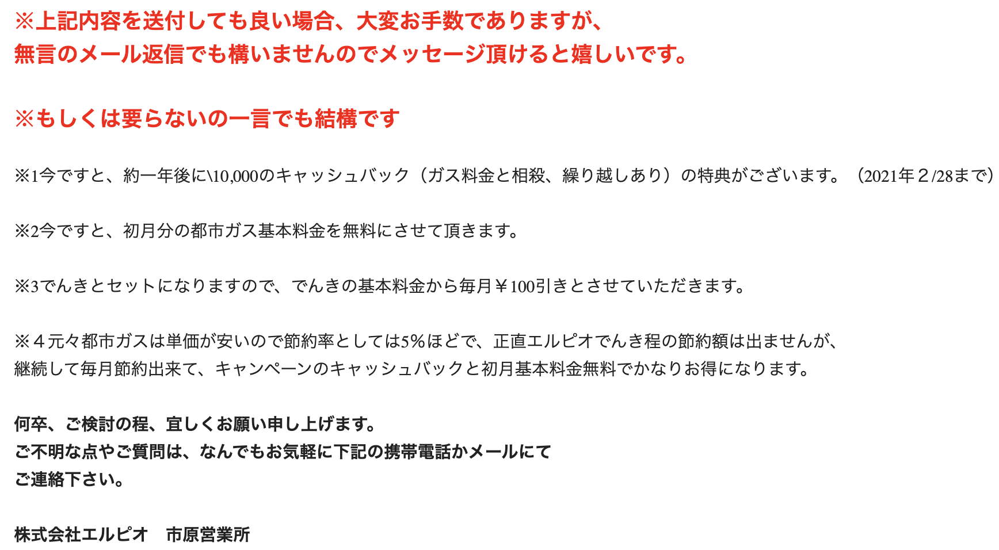
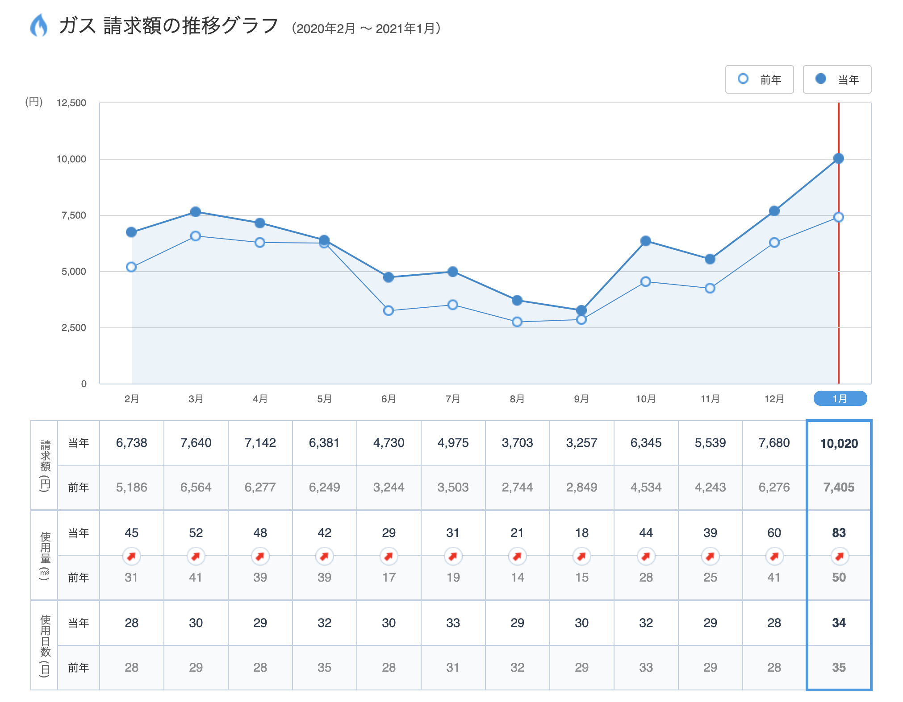
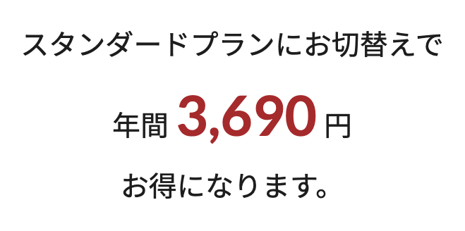

なんとなくメールボックスを眺めていたら、アツい営業のメールが来ておりエルピオが[エルピオ都市ガス](https://lpio.jp/city_gas/)を始めたことを知った。数年前からエルピオでんきを契約しており、満足していたので、ガスの契約もエルピオに切り替えることにした。

## ガスの使用量が増えている

[myTOKYOGAS](https://members.tokyo-gas.co.jp/) で我が家のガスの使用量を調べたところ、去年からすべての月で増えており、リモートワークの影響を感じた。毎食自炊をするようになったのもあると思う。

調べると [2 人家族の平均使用量は 25㎥](https://kepco.jp/gas/consumption/) らしいので、これはちょっと使いすぎのようだ。空調はエアコンなので、給湯とガスコンロだけでこれだけ使っていることになる。

## 年 5,000 円下げられる

エルピオのサイトでガス使用量を打ち込んでシミュレートすると、我が家の使用量では年 3,700 円ほど安くなることがわかった。でんきとガス両方の契約で毎月 100 円オフなので、トータルで年 5,000 円ほど安くなりそう。

## 申し込み

サイトをざっと確認して、プランに縛りがないことと、工事が不要なことを確認して、申し込むに至った。申し込みはネット上で数分で終わった。でんきの契約がある（すでに住所や支払い方法の情報は持ってるはず）にも関わらず、再び住所や支払い方法を入力させられたが、気にしないことにする。

2 月中はキャンペーンで 10,000 円キャッシュバックらしいので、気になる関東在住の方は[サイト](https://lpio.jp/city_gas/)を訪れてみて。
