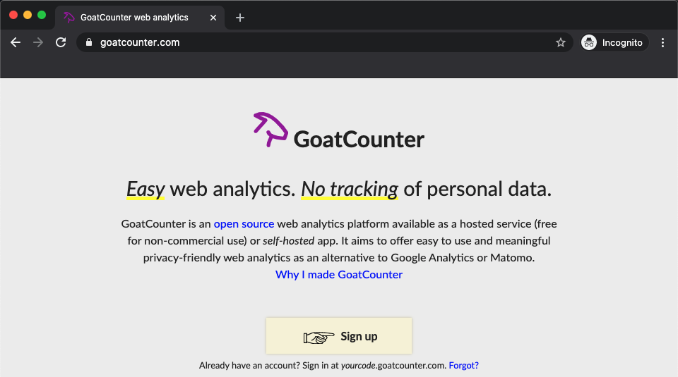
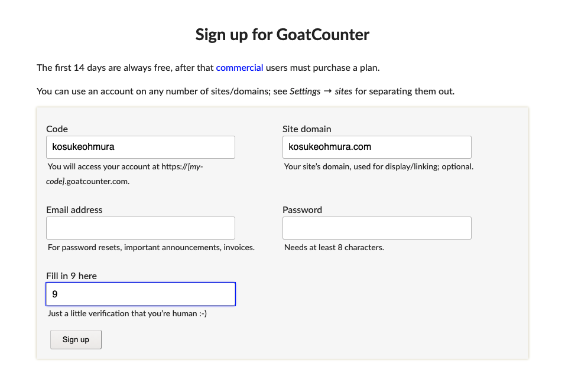
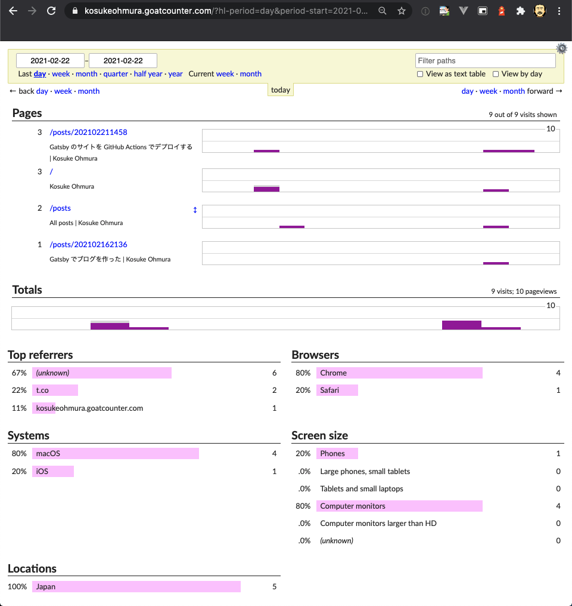
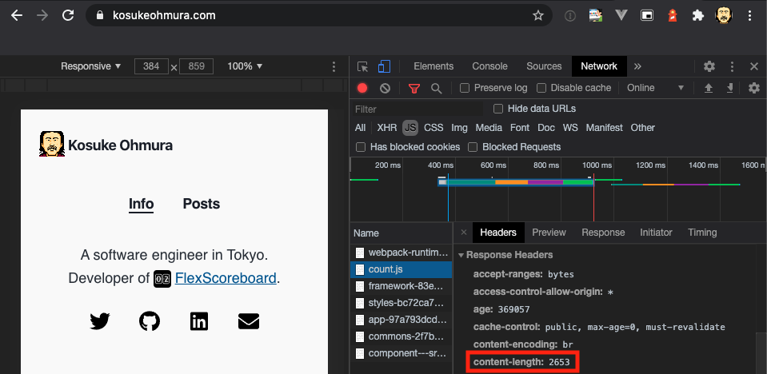

ブログへのアクセス状況を知りたく Google Analytics を導入しようと思ったけど、自分の要求に対しては機能が過剰だと感じて、代わりに [GoatCounter](https://www.goatcounter.com/) を導入した。

## Google Analytics は自分にはオーバースペック

アナリティクスといえば GA でしょ、ということで Google Analytics を導入しようと思ったが、よくよく考えてみると、自分が知りたいのは記事ごとのアクセス数ぐらいで、Google Analytics の Web コンソールに表示されるほとんどの情報は自分にとって不要だった。

また Google Analytics はユーザーをトラッキングする。これによってプライバシーポリシーの記載に気を使う必要が出てきたり、GDPR を守るために Cookie の使用をオプトアウトできるような実装が望ましくなるが、求めていない機能のためにこうした労力を払いたくなかった。

## GA の代替としての GoatCounter

軽量でミニマムなアナリティクスツールは無いものかとググったところ、GoatCounter を見つけた。GoatCounter は個人開発されている、軽量な Go 製のアナリティクスツール。非商用利用だと無料で使用できる。導入が簡単で、ユーザーのプライバシーへの考慮がなされており、それでいてユニークのビジター数がわかる。サイトの説明をひとしきり読んで、自分のニーズにマッチするものだと確信したのでサインアップした。

## 導入する

コードベースの変更は Gatsby 用のプラグイン [gatsby-plugin-goatcounter](https://www.gatsbyjs.com/plugins/gatsby-plugin-goatcounter/) が存在するのでそれを使うだけで終わった。ソースコードの変更は[こちら](https://github.com/KosukeOhmura/kosukeohmura.com/commit/46535b337506f49538bdeade5401c2ef49b5c8e6)。デプロイして自分でサイトにアクセスすると、数秒後にはダッシュボードにアクセスが表示された。簡素だがサクサク動いて使い勝手が良い。

読み込まれる JavaScript も 2.5KB 程度で、謳い文句通り軽量だった。これは GA に使う gtag.js の 1/10 以下。`async` で読み込むとはいえ、これならユーザー体験への影響はほとんどないはず。

## 寄付した

思想もプロダクトも気に入り、長く続いてほしいと思い、少額 Donate した。
