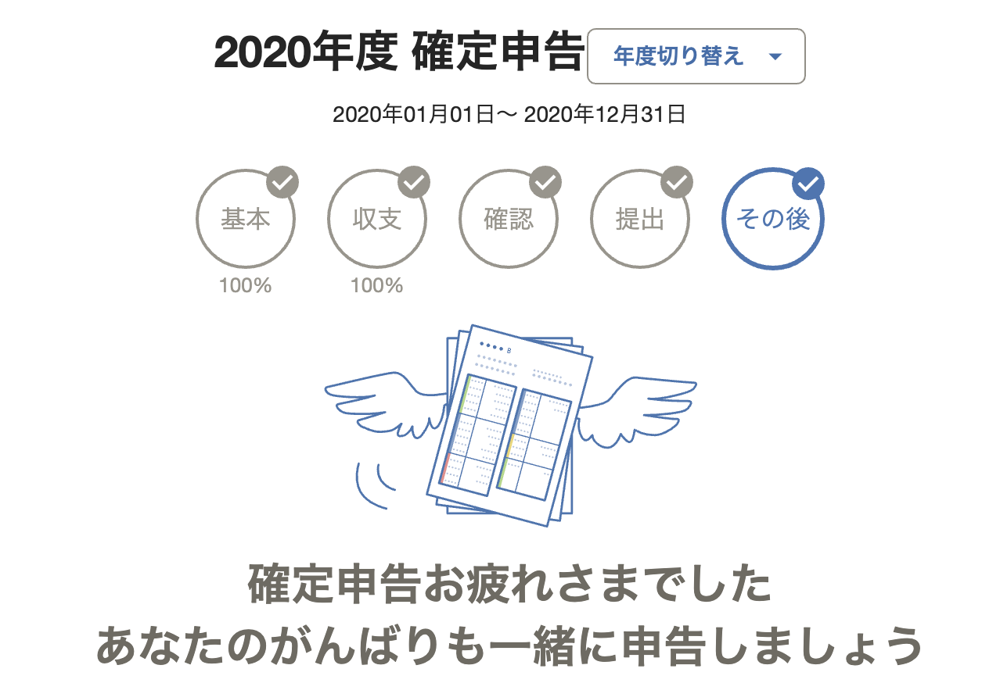
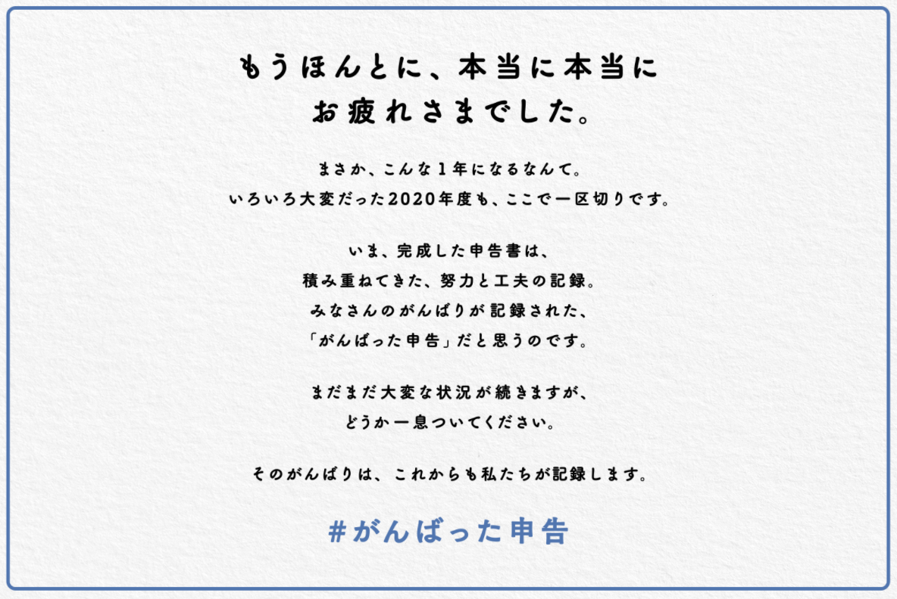

2020 年分の確定申告を終わらせたので、やり方を残しておく。今年で 2 回目。

## 会社員なら不要では？

春までは個人事業主だったのと、[個人開発している iOS アプリ](http://flexscoreboard.kosukeohmura.com/)の売上が少しあり、確定申告をする必要がある。

## やり方

確定申告の時期に会計 freee のスタータープランを一ヶ月だけ契約して、その指示通りに確定申告書類を作る。提出は e-Tax。面倒だけどやれないこともない数なので、売上や経費、医療費はすべて手で入力した。freee の自動仕分け機能は使わず、書類作成と提出のみに freee を使う形。

以下細かいやり方。

### 書類の管理

年ごとに 1 枚の茶封筒を用意し、日頃から発生した紙はそこに雑に溜めておく。確定申告の時期にそれらを取り出して一気に処理する。封筒に溜めるのは以下のような書類。

- 経費・医療費の領収書
- ふるさと納税の証明書
- 税・年金の通知書

確定申告が終わっても書類は捨てず、封筒に「2020」などと書いてアーカイブしておく。

### 紙の発生しないトランザクションの集計

フリーランスでの売上は請求書を Google ドライブで開いて確認する。経費や個人開発アプリの売上は、銀行口座の入出金明細とクレジットカード使用明細をそれぞれダウンロードし、1 年分をテキストエディタで開いて、grep しながら抽出する。

### 提出してプランを解約する

作成した書類を freee の iOS アプリを使って e-Tax で提出する。途中で NFC でマイナンバーカードを読み取る。終わったらそのまま有料プランを解約する。解約時フォームに少しフィードバックを残して、終了。

## 振り返り

提出までの作業時間はだいたい 4 時間程度だった。少し慣れたので、来年は半分くらいの時間で終わらせたい。少し使いづらいけど、来年も会計 freee にお世話になりそう。
