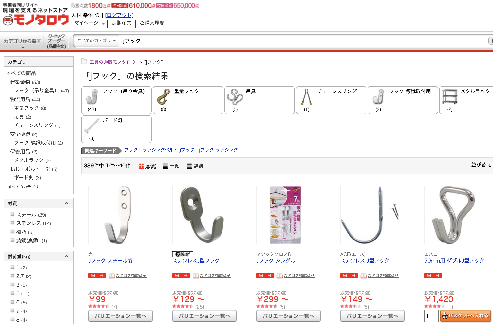
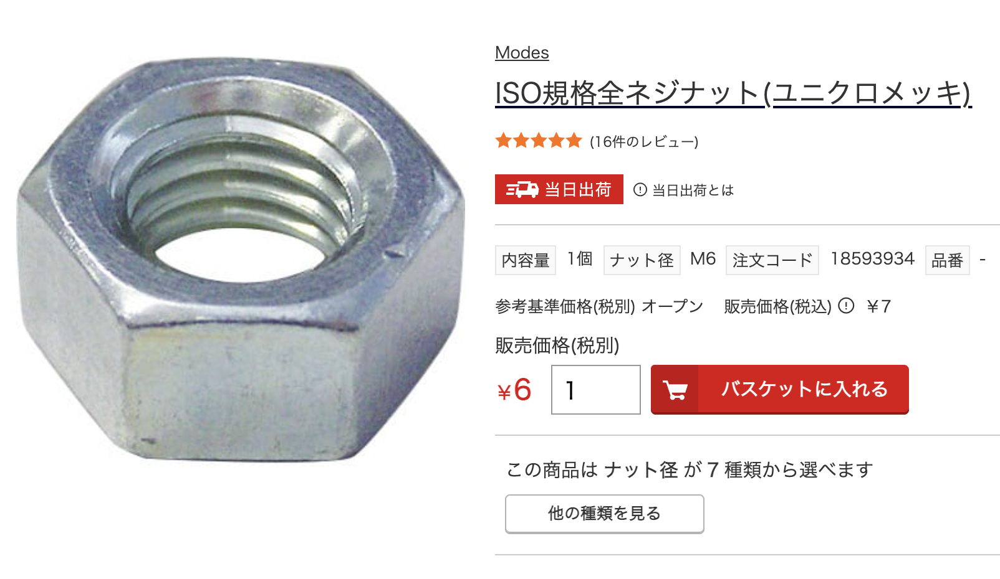
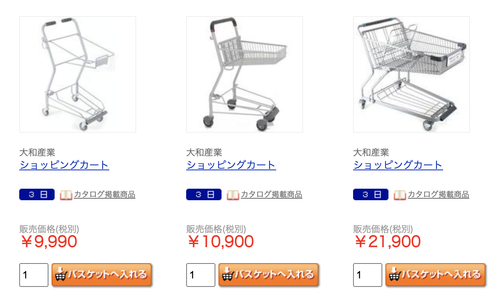

[モノタロウ](https://www.monotaro.com/)は事業者向けの通販サイトだけど、個人でも使えて便利なので、たまにモノを買っている。

## 個人でも使えるモノタロウ

「現場を支えるネットストア」モノタロウでは、事業者向けだけあって、ネジやタッパー１つとっても様々な商品が存在するのと、業務用商品が売っているのが特徴。個人でも問題なく使える。

サイトの機能も割としっかりしていて、例えば金具の形はイメージできても、名称がわからないときにカテゴリ検索になんとなく頼っていけば目的の商品にたどりつける。値段は物にもよるけど、特にモノタロウオリジナル商品や、業務用の商品は安く感じる。

便利な点として、ネジとかを 1 本から買えるのがある。Amazon だと小ロットの取り扱いがないため、仕方なく 50 本入とかを買う事になるが、必要分だけ数を指定して買えるので便利。

## 使い方

基本的には日用品をまとめて買うのに使う。3,500 円未満の注文には送料がかかるので、ある程度まとめ買いをする。注文からだいたい数日で届く。

よく注文するのは以下のようなもの。

- ティッシュ、ペーパー類
- サランラップ、アルミホイル
- ゴミ袋、ジッパー袋
- 歯磨き粉、洗口液
- なべ、箱などの小物
- テープ類
- ネジやフックなどの金具

## 業務用商品を見るのは楽しい

最近モノタロウからカタログ本が送られてきて、目を通して感じたことは本当に多彩なものが売ってること。例えばスーパーで使うショッピングカートや野菜の販売棚にある値札、ビジネスホテルで使う使い捨て歯ブラシなどの単価が見れて楽しかった。

