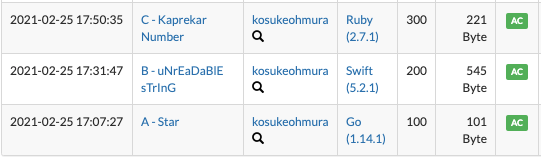
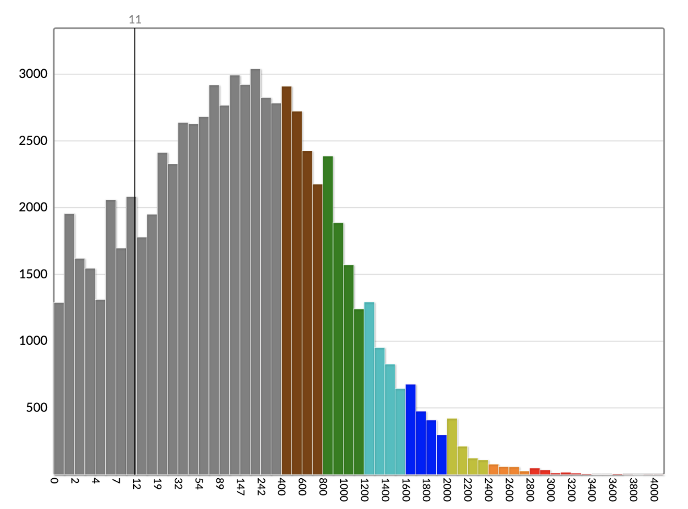

同僚に誘われて競技プログラミングのサイト [AtCoder](https://atcoder.jp/) に登録し、手ほどきを受けたので、自分もやってみるぞということでコンテストに一度参加した。

## 自分の競プロのレベル

- プログラマ 5 年目
- 競プロはやったことがない
- オーダー記法の概念を知っている
- スタック、キュー、木など基本的なデータ構造を知っているが、実装はしたことがない
- いくつかのソートアルゴリズムの実装例を見たことがあるが、実装はしたことがない

## いったん Ruby でやることに

自分がそこそこ書ける言語で、試しにいくつか問題を解いてみた。

その結果、型のある言語よりもスクリプト言語が簡潔に書けて良いと感じ、一旦 Ruby でやることにした。競プロでの Ruby は遅いのでおすすめされないと聞いたが、まず競プロになじむことを優先し、言語のパフォーマンスで困ったら改めて言語選定をすることにした。

## ABC コンテストに参加してみて

ABC コンテストという、土曜日の 21 時に出題され 90 分の間で実装を競うオンラインのイベントがある。今日行われた [ABC193](https://atcoder.jp/contests/abc193) に参加した。結果は A から F までの問題の中で、A と B しか解けなかった (後ろに行くにつれて難易度と配点が高い)。想定はしていたけど残念。

ありがたいことに、公式の解説があるのでこれから解けなかった問題の解説を見る。また Twitter での感想戦が盛んに行われており眺めていると楽しい。同じく C 問題が解けなかった人も結構いて、励みになる。

## やっていく

AtCoder には過去のコンテストの成績に応じてレーティングがつく。レーティングは色分けされており、はじめたばかりの自分は一番下の灰色。まずは赤になることを目指してやっていきたい。
