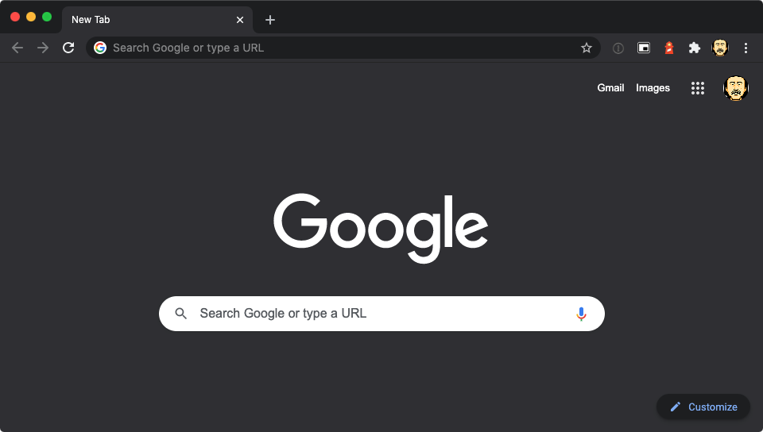

よくアクセスする Web サイトをブラウザでブックマークしていたけど、自分には要らないことに気づいて、使わなくなった。

## ブックマークのつらみ

子供の頃 Internet Explorer を使ってたときからずっとブラウザのお気に入り機能は当たり前に使用してきた。よくアクセスするサイトをとりあえず登録しておいて、気が向いたときにフォルダ分けする。

数年前までなんとなくブックマーク機能を使ってきたが、アクセスするサイトが増え、その管理が大変と感じるようになった。たまには使わなくなったサイトを削除する作業が必要だし、どのサイトを厳選してブックマークするか決めないと、使いづらくなってしまう。

最近はブラウザのサジェストも優秀だし、最悪ググれば目的のサイトにたどり着けるし、ブックマークを使う意味って実はそんなにないのでは？と考えるようになった。

## ブックマークぜんぶ消す

1 ~ 2 年くらい前、勢いですべてのブックマークを消してみたら思ったほど困らなかったので、そのままブックマーク機能の使用をやめた。それ以降、サイトへアクセスするときはアドレスバーの予測候補表示を使うか、履歴内を検索して目的のサイトを探している。それで見つからないときは（ほとんどないが）、チャットツールなどを検索する。

ブックマークを消したデメリットとして、ブラウザに蓄積された履歴への依存が強まるのがある。実験的に履歴を全部消してみたけど、ブックマークの使用を再開したくなるほど困ることはなかったので、気にしないことにした。
