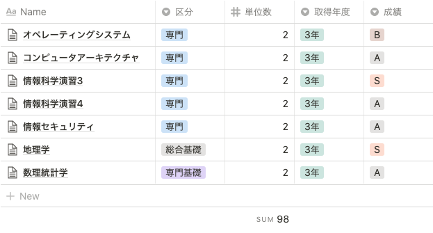

都内でフルタイムのソフトウェアエンジニアの仕事をしながら、帝京大学の通信教育課程の学生をやってます。3 年目が終わったので振り返り。

## 実績

今年度は 7 教科、14 単位を取得した。入学してから通算で 98 単位を取得していて、卒業まではあと 26 単位。

## 3 年目の変化

2 年次は 30 単位くらい取ったのに 3 年では取得単位が半減してしまったのでその~~いいわけ~~背景を書く。

### GPA を重視するようになった

通信の大学に入学してから一番心配だったことは、自宅での勉強が面倒になって諦めてしまうことだった。なので成績よりも獲得単位数の最大化を重視してやってきた。具体的には多少自信がなくてもレポートを出して、あまり試験勉強もせずに試験に臨んでいた。一番多いときで 1 期に 5 教科受けた。

しかし大学に入って 3 年が過ぎ卒業要件の 80% の単位を取得できた今、卒業の確度はかなり上がっている。卒業後の院進の可能性ももしかしたらあると思っていて、海外の大学院の足切りラインになる GPA 3.0 は死守しておきたいと思うようになった。今までの成績を GPA 換算すると 3.2 で、これからは 1 教科 1 教科割と丁寧に受けて GPA をキープしていきたい。

### ゆとりを優先した

コロナで自宅に引きこもっており、ストレス耐性の低下の懸念があるのであまり自分を追い込まないようにしていた。自宅で長い時間を一緒に過ごす妻とのコミュニケーションも大切にしたく学業はほどほどにした。

春から正社員になって労働時間が増えたのも少しある。残業は月 10 時間くらい。

## コロナ禍での大学の変化

元から自宅学習なので基本的に変わらないが、今年度は試験をリモートで受けることになったり、対面授業が自宅学習に切り替わったりした。遠方に住んでる方には都合がよかったと思う。

自分の住まいはキャンパスまで 4 駅で、対面授業も履修していなかったのであまり影響がなかった。

## やっていく

来年度卒業までいくかはわかりませんが引き続きやっていきます。質問などは [Kosuke Ohmura (@kosukeohmura) / Twitter](https://twitter.com/kosukeohmura) までどうぞ。

## あわせてよみたい

過去にも大学について書いてます

- [帝京大学の通信教育課程の学生やってます - kosukeohmura’s blog](https://bnpb.hatenablog.com/entry/2019/05/26/135022)
- [帝京大学通信教育課程、 2 年目の状況 - kosukeohmura’s blog](https://bnpb.hatenablog.com/entry/2019/12/09/000016)
