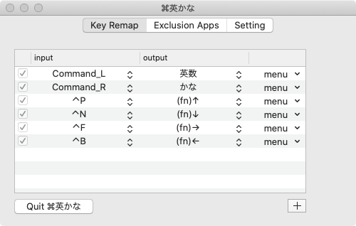

Mac を US キーボードで使っていて簡単に入力ソースを切り替えたいと思い、`⌘` キーのみで切り替えができるようにした。キーボードは Apple の Magic Keyboard を使っている。

## これまでの設定と気持ち

これまでは

- `左 ⌘ + Space` で英数入力
- `右 ⌘ + Space` でかな入力

で切り替えていたが、キー操作が面倒になり、もっとシンプルな手順で入力ソースを切り替えたいという思いが強まった。

昔は `⌘(左右問わず) + Space` で英数入力とかな入力をトグルする設定で使っていたが、トグルする際に現在の入力ソースを認識する必要があるのでよく間違えていた。切り替え操作を行ったとき、Current State に関わらず、目的の入力ソースに切り替えられる手順が望ましいと思っている。

## 新しい設定

最近ちょうど Mac を初期化する機会があったので、それまで使っていた Karabiner-Elements の代わりに [⌘英かな](https://ei-kana.appspot.com/) をインストールし、以下のように設定しなおした。

- `左 ⌘` 単体で英数
- `右 ⌘` 単体でかな入力

設定後は押すべきキーの量が減ったので入力が楽になったと感じている。GitHub の Pull Request の説明を書く時などは切り替えを多用しがちなので、特に恩恵を感じる。

`⌘` キーを「単体で」押下するのが意外と難しく、他のキーと同時に押してしまわないように少し訓練が必要だった。数日でだいぶ慣れた。
