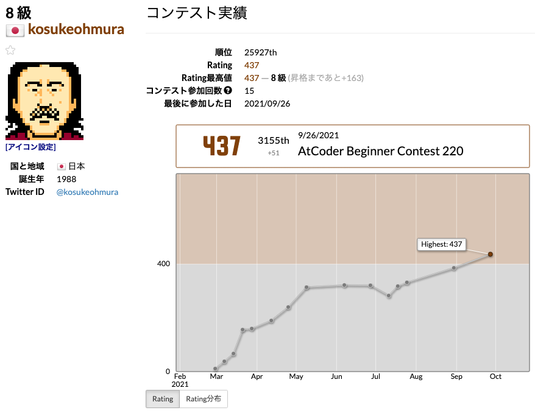

[7 ヶ月前に始めた AtCoder](../202102280035) でようやく茶色になった。嬉しい。

## 茶色になるまでにやったこと

ABC コンテストに 15 回参加して、解こうとして解けなかった問題の公式解説を読んだり、YouTube の解説を観たりした。いつも AB の 2 完か ABC の 3 完だった。コンテストに参加する以上の勉強はしていない。

## 始める前からの変化

時間計算量を意識するようになった。TLE (実行時間オーバー) になったら問題が解けたことにならないので、問題文を見て計算量をどう節約しようかと考えるようになった。

それと、問題をよく読まずにコードをなんとなく書き始めてしまうようなところがあったのが、少し改善された。

## これから

このままゆるく続けてみる。気が向いたら少し勉強するかもしれない。
