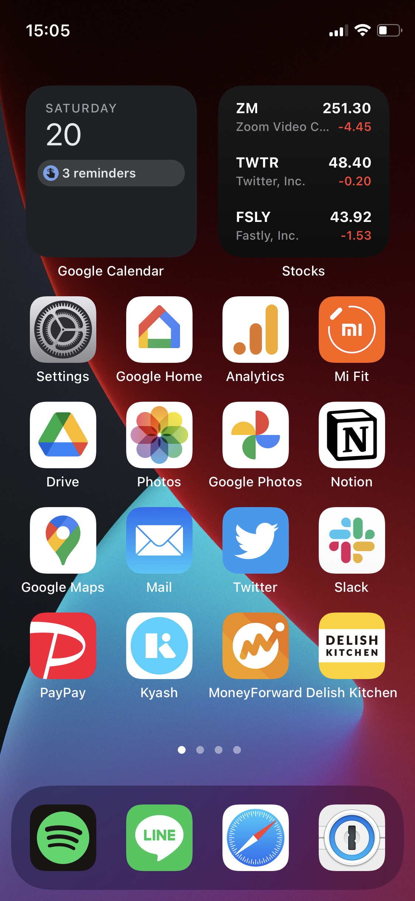

iPhone 12 mini を買った。これまでは iPhone 7 を長いこと使っていた。

## 写真の品質差にショックを受けたのがきっかけ

iPhone 7 は防水で Suica も使えて、現時点で最新の iOS も入るので特に不満なく使ってきた。だけど最近 iPhone 13 と 7 で写真を撮り比べてみたら、差が歴然だったので新しいのがほしくなった。

新し目のモデルなら十分に満足できるだろう、ということで値崩れしていた iPhone 12 mini をメルカリで買った。新品で 5.8 万円弱。

## サクサク動くので最高、大きさも丁度いい

1 日使ってみて、とても満足している。性能が大幅に上がっておりかなりサクサクに感じるのと、OLED ディスプレイが綺麗で、大きさも親指が届くサイズでちょうどよい。バッテリーもゲームをしないので十分持つ。

慣れない点として、ホームボタンと 3D Touch が無くなったのがある。それと Touch ID がないのでマスク着用時のロック解除が面倒。Apple Watch があればマスクを着けていても簡単にロック解除できるそうで、Apple Watch が欲しくなる。

5G も入るようにはなったが、渋谷駅周辺で遊んでいても 5G で安定しないので docomo の 5G エリアはまだまだ狭い感じを受けた (SIM は [IIJmio を使っている](../202103200245))。

## セットアップは 1 から

iPhone 移行時にはクイックスタートや iCloud バックアップから復元といった機能は使わず、1 から設定を行うことにしている。設定アプリで上から順に設定をやっていくと、OS が上がってデフォルトの設定が変わっていたり、新しくできた設定項目に出会えてなるほど〜となったりする。

快適にするまでに数時間かかるが、新居にゴミを持ち込みたくない精神で、ウィジェットやホーム画面、コントロールセンターの配置も含めて見直す機会としている。

## 新しいガジェットを使う

最後に、改めて感じた新しいガジェットを使うことの価値について。新しいほうがスペックが良いことはもちろんだが、技術の進歩と UI の進化と、世の中のトレンドをなんとなく肌で感じた気分になることが出来て嬉しい。
