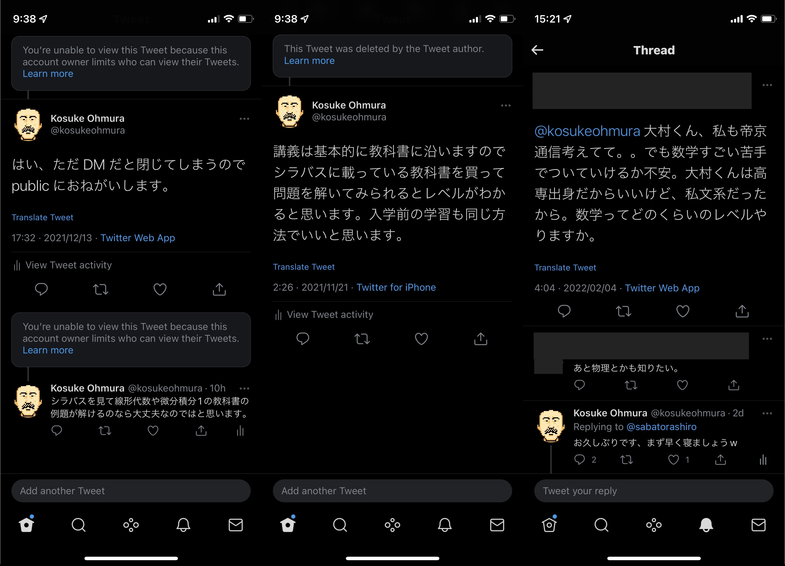

帝京通信で求められる数学力をたまに聞かれるので考えた。

## モチベーション

Twitter ([@kosukeohmura](https://twitter.com/kosukeohmura)) やこのブログで [帝京大学の通信教育課程](https://www.teikyo-u.ac.jp/faculties/correspondence) の学生であることを公にしていると、数学が原因で入学を迷っている人からこんな質問をいただく。

> 自分、数学自信ないのですが、こんな自分でも入学して大丈夫でしょうか？

知らんがな、とも思うが近頃知り合いが入学を考えており、入学後に求められる数学力の測り方について自分なりに語ってみる。ちなみに自分も高専卒ではあるが数学には苦手意識を持っており、数式を見ると軽く絶望したりする。

## 必要な数学力

学習は自分のペースでやれば良いし、知識の不足は時間を使うことである程度補える。例えば三角関数の理解は必須だが、入学後のキャッチアップも十分可能だと思う。卒業できるかに大きく影響するのは、入学時に持ち合わせる数学力ではなく、学習時間や習慣化だと思う*。

とはいえ在学中のキャッチアップにも限度はあるので、とても雑に言うと、基本的な中学数学が分かっていればいいんじゃないだろうか。

<small>*偉そうに言っているが自分はまだ卒業していないし 4 年での卒業はできなかった</small>

## シラバスや教科書を読もう

入学してから必要となる労力を測る上では、Web 上に公開されているシラバスを読むのが良いと思う。シラバスには科目ごとに到達目標や使われている教科書と、学ぶ単元が書いてある。

[帝京大学 宇都宮キャンパス](https://www.e-campus.gr.jp/syllabus/kanri/utsunomiya/public/syllabus/2021/discipline/5)

シラバスを読んだら、気になる科目の教科書をいくつか買ってみることをおすすめしたい。たいてい中古本がメルカリで 1,000 円以下で出ている。数問でいいから例題を解いてみるとなお良い。科目や先生によってブレはあるが、以下を肌で感じられると思う:

- そもそも、学習して行けそうか
- 学ぶことのレベルは自分にとってどうか
- 1 科目はどの程度のボリュームか
- 卒業要件を満たすために、どれぐらい労力を割く必要がありそうか
- …果たして卒業は現実的だろうか？改めて、やる価値はあるだろうか？

ここまで書いても「いや、そこまでして知りたくはないんだけど」と実行しない方が大半だとは思うが、入学してしまうと初年度で辞めても 20 万くらいかかるし、卒業するためには数十時間 x 62 科目と多大な時間がかかる。せいぜい 1,000 円と 10 時間程度で入学後の感覚を肌で感じることができれば、悪くないディールだと思う。

## 過去に書いた大学に関する記事

- [帝京大学通信教育課程、学生 3 年目の状況](../202103111121)
- [帝京通信、2021 年度の履修科目選び](../202103260107)
