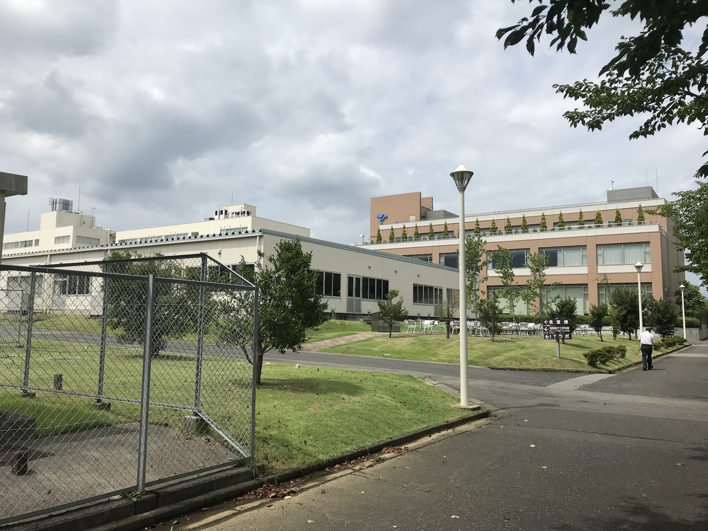
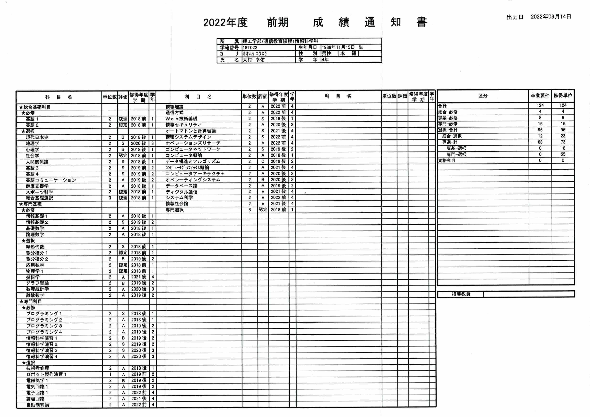
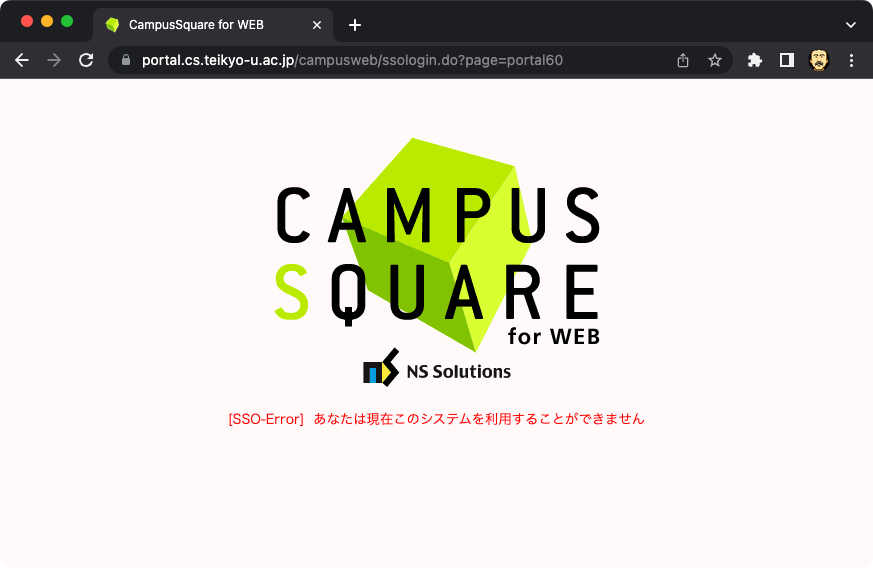

29 歳のときに入学した大学を、働きながら 4 年半かけて卒業しました。

## 卒業までの取り組み方

入学した当初は学習習慣を維持できるかが一番の懸念で、卒業を諦めることを恐れていました。なので 1, 2 年生の頃はなるべく多く単位を取るようにしていました。具体的には取りやすそうな科目を選び、英語の単位認定のため TOEIC を受け、スクーリングへは全て出席しました。

3 年生になる頃には (入学時の単位認定を含めて) 84 単位を習得しており、入学時よりもはるかに卒業が現実的になっていました。3 年次以降は成績を重視しながら、興味の湧く科目をゆったりめのペースで習得しました。3 年次から仕事が業務委託から正社員雇用になり勤務時間が増え、学習に充てる時間が減ったのもペースが落ちた理由の一つです。そんな感じで、4 年半かけての卒業となりました。

## 成績

GPA は 2.8 ぐらいだと思います。正式な GPA は大学へ確認中です。

1, 2 年次 (2018, 2019 年) は単位を稼ぐ事を重視していたので、テスト勉強をあまりせずに試験を受けた科目も多く、評定が低めです。3 年次以降は成績を意識し、半分は S を取る事を目指していたのですが、思うようには取れませんでした。科目によるのでしょうが、ほぼ満点を取る勢いでないと S は取れない印象です。GPA が 3.0 は欲しかったと思いますが、仕方ないですね。

## 入学して良かったか

学位の取得を第一の目的としていたので、達成できて良かったです。それ以外の面でもまあ行って良かったんじゃないかと思います。

入学時はコンピューターサイエンス (CS) の基礎を全て習得する気持ちでしたが、その世界は思っていたよりはとても広そうで、一度の人生で全てを網羅するのは難しいことがわかりました。ただ、通信や暗号化、コンピューターの仕組みや、幾何学やグラフ理論など一見何の意義があるのかわからないようなものも、自分でも一定の理解ができることを体感できたのは嬉しいことでした。学費を払って期限内にレポートや試験で習得を示さなければならない、強制力の働く環境があることで机に向かう習慣を継続することができたように思います。

それと良かったこととして、入学時点では数式を見ると絶望していたのが、少しは読むようになりました。また最近は仕事で CS 院卒のエンジニアのメンターをしており、業務の中でアカデミックな話題が出てもある程度話せています。

各講義で学ぶことは大体その分野の基本的なことなので、すぐに直接実務で役立つことは少ないと感じます。

大学のシステムが使いにくかったり、一部講義の内容が古い、一部科目の手書きレポートが大変、レポート課題を郵送するのが面倒、先生のレスポンスやレポート添削が遅いことがある、などのオーバーヘッドがあったのも事実です。

## これから

大学に使っていた分の時間を自由に使えるようになるので、今後しばらくは大学を優先して積んでいた技術書を読んだり、放置してしまっている個人開発を再開していきます。ワインエキスパートの資格も取りたいし、積んでいたゲームもやりたいですね。一通り満足したら修士の道を考えるかもしれません。

## その他、細かいこと

### 学習に使っていたツール類

- PC は Mac のみ
    - 科目によっては Windows がないと少し困ることもあったが、何とかなった
- 講義資料やレポート、学生便覧などの資料は全て Google Drive に保管
- レポートは VSCode で Markdown で記入
    - [vscode-markdown-pdf](https://github.com/yzane/vscode-markdown-pdf/blob/master/README.ja.md) で PDF 化して提出
        - Word 指定の科目も許可とって PDF で出す
    - 図表は draw.io で
- 履修計画は Notion のデータベースで管理
- テスト勉強は紙に手書き
    - iPad + Apple Pencil も試したけど自分には紙がよかった

### 使っていた学割

- Github Pro プラン
- Spotify
- YouTube Premium
- Amazon Prime Student
- Notion Personal Pro プラン
- Apple Store
- タイムズカー
- 映画館、美術館など

## 過去に書いた大学のこと

- [帝京大学の通信教育課程の学生やってます - kosukeohmura’s blog](https://bnpb.hatenablog.com/entry/2019/05/26/135022)
- [帝京大学通信教育課程、 2 年目の状況 - kosukeohmura’s blog](https://bnpb.hatenablog.com/entry/2019/12/09/000016)
- [帝京大学通信教育課程、学生 3 年目の状況 | Kosuke Ohmura](https://kosukeohmura.com/posts/202103111121/)
- [帝京通信、求められる数学力の測り方 | Kosuke Ohmura](https://kosukeohmura.com/posts/202202060620/)
